# System Design Diagrams: Data Flow Diagrams (DFD) & UML Use Case Diagrams
## Project: **Code Quest (Placement Preparation & Assessment Platform)**

---

## Table of Contents
1. [Executive Overview](#1-executive-overview)
2. [UML Use Case Diagrams](#2-uml-use-case-diagrams)
   - [2.1 Actor Catalog](#21-actor-catalog)
   - [2.2 System-Wide High-Level Use Case Diagram](#22-system-wide-high-level-use-case-diagram)
   - [2.3 Subsystem Use Case Diagrams](#23-subsystem-use-case-diagrams)
     - [2.3.1 DSA Arena & Code Execution](#231-dsa-arena--code-execution)
     - [2.3.2 Safe SQL Playground](#232-safe-sql-playground)
     - [2.3.3 Real-Time Multiplayer Code Battles](#233-real-time-multiplayer-code-battles)
     - [2.3.4 AI Mock Recruiter & ATS Resume Scanner](#234-ai-mock-recruiter--ats-resume-scanner)
     - [2.3.5 Institutional Admin & TPO Telemetry](#235-institutional-admin--tpo-telemetry)
   - [2.4 Tabular Use Case Specifications](#24-tabular-use-case-specifications)
3. [Data Flow Diagrams (DFD)](#3-data-flow-diagrams-dfd)
   - [3.1 Data Flow Notation & Conventions](#31-data-flow-notation--conventions)
   - [3.2 DFD Level 0 — Context Diagram](#32-dfd-level-0--context-diagram)
   - [3.3 DFD Level 1 — System Decomposition Diagram](#33-dfd-level-1--system-decomposition-diagram)
   - [3.4 DFD Level 2 — Micro-Process Pipelines](#34-dfd-level-2--micro-process-pipelines)
     - [3.4.1 DFD Level 2.1: DSA Code Compilation & Sandboxed Execution](#341-dfd-level-21-dsa-code-compilation--sandboxed-execution)
     - [3.4.2 DFD Level 2.2: Safe SQL Transactional Execution Engine](#342-dfd-level-22-safe-sql-transactional-execution-engine)
     - [3.4.3 DFD Level 2.3: Real-Time Battle Matchmaking & Redis SETNX Settlement](#343-dfd-level-23-real-time-battle-matchmaking--redis-setnx-settlement)
     - [3.4.4 DFD Level 2.4: AI Mock Interview & Resume ATS Parsing Flow](#344-dfd-level-24-ai-mock-interview--resume-ats-parsing-flow)
4. [Data Dictionary](#4-data-dictionary)

---

## 1. Executive Overview

This document presents the complete formal behavioral and architectural modeling diagrams for **Code Quest**. 
It encompasses:
1. **UML Use Case Diagrams**: Modeling human actors, system actors, external services, and use case dependencies (`<<include>>`, `<<extend>>`).
2. **Data Flow Diagrams (DFD)**: Multi-level process decompositions conforming to Gane & Sarson / Yourdon conventions:
   - **Level 0 (Context Diagram)**: Outlines external system entities and overarching data boundaries.
   - **Level 1 (System Decomposition)**: Maps core system processes (1.0 to 8.0) and primary data stores (D1 to D6).
   - **Level 2 (Process Logic Pipelines)**: Explodes mission-critical sub-systems (Code Sandbox, Safe SQL Engine, Atomic Battle Engine, and AI Services) into fine-grained procedural steps.

---

## 2. UML Use Case Diagrams

### 2.1 Actor Catalog

| Actor | Category | Role & Capabilities |
|---|---|---|
| **Student / Candidate** | Human (Primary) | Engineering candidate practicing DSA, SQL, CS fundamentals, participating in code battles, taking AI interviews, auditing resumes, and tracking personal readiness. |
| **Admin / TPO** | Human (Primary) | Training and Placement Officer / College Administrator monitoring cohort activity, analyzing drop-off funnels, inspecting individual student logs, and managing curriculum. |
| **Battle Host** | Human (Specialized) | Candidate or organizer initiating a private or public 1v1 battle room and distributing the contest code. |
| **Code Judge Sandbox** | System / External Actor | Docker container daemon or cgroup-constrained host subprocess evaluating untrusted code in Python, C++, Java, and JavaScript. |
| **Google Gemini AI API** | External Cloud Service | LLM service providing multi-turn conversational mock technical interviews and ATS semantic resume evaluations. |
| **PostgreSQL Database** | Storage System | Relational data persistence providing transactional execution with explicit rollback guarantees for student SQL queries. |
| **Redis In-Memory Engine** | Distributed System | High-throughput broker managing WebSocket pub/sub rooms and atomic distributed locks via `SETNX`. |

---

### 2.2 System-Wide High-Level Use Case Diagram

*High-Resolution Image: [images/use_case_diagram.jpg](./images/use_case_diagram.jpg)*

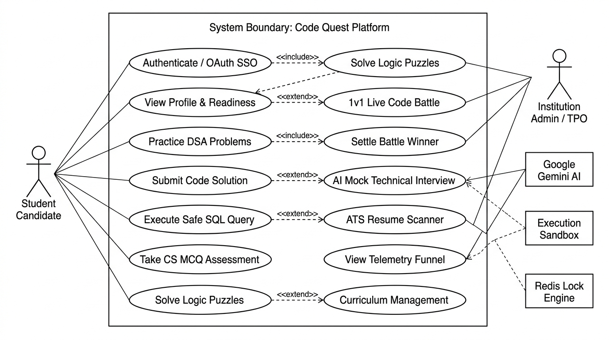

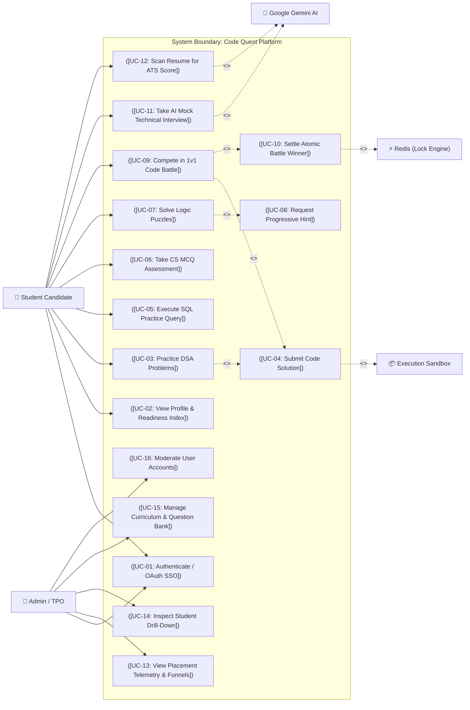

---

### 2.3 Subsystem Use Case Diagrams

#### 2.3.1 DSA Arena & Code Execution

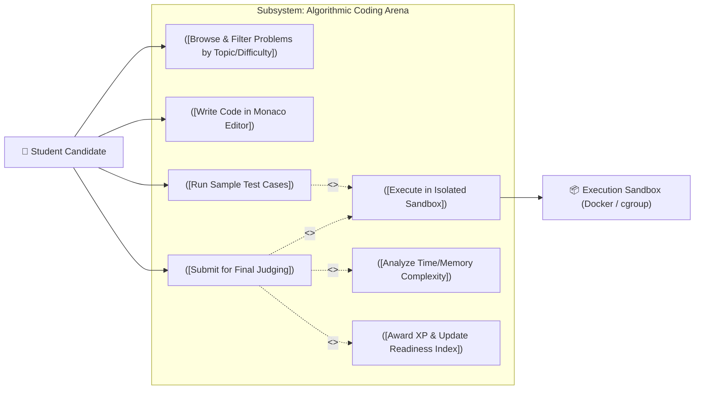

---

#### 2.3.2 Safe SQL Playground

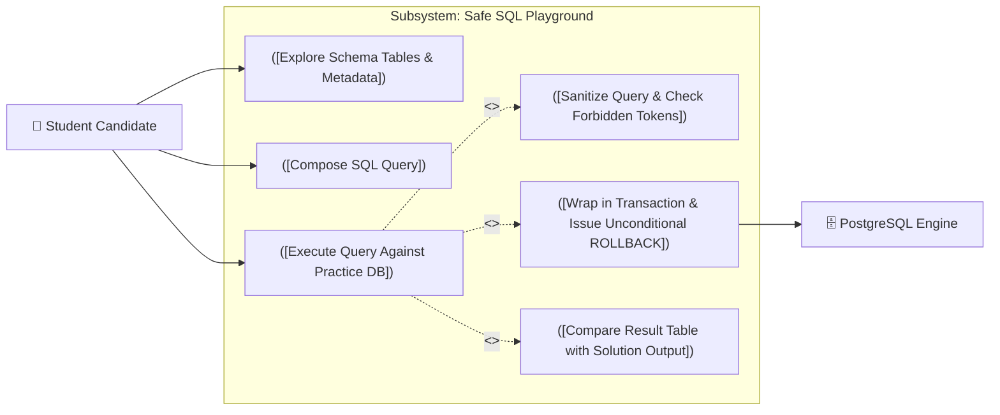

---

#### 2.3.3 Real-Time Multiplayer Code Battles

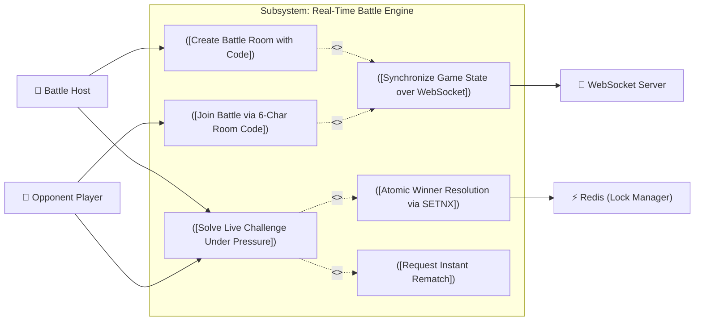

---

#### 2.3.4 AI Mock Recruiter & ATS Resume Scanner

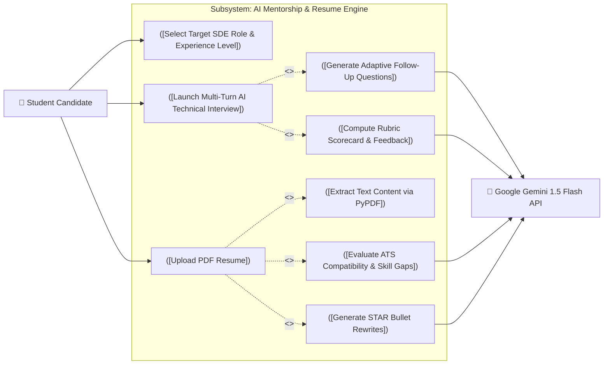

---

#### 2.3.5 Institutional Admin & TPO Telemetry

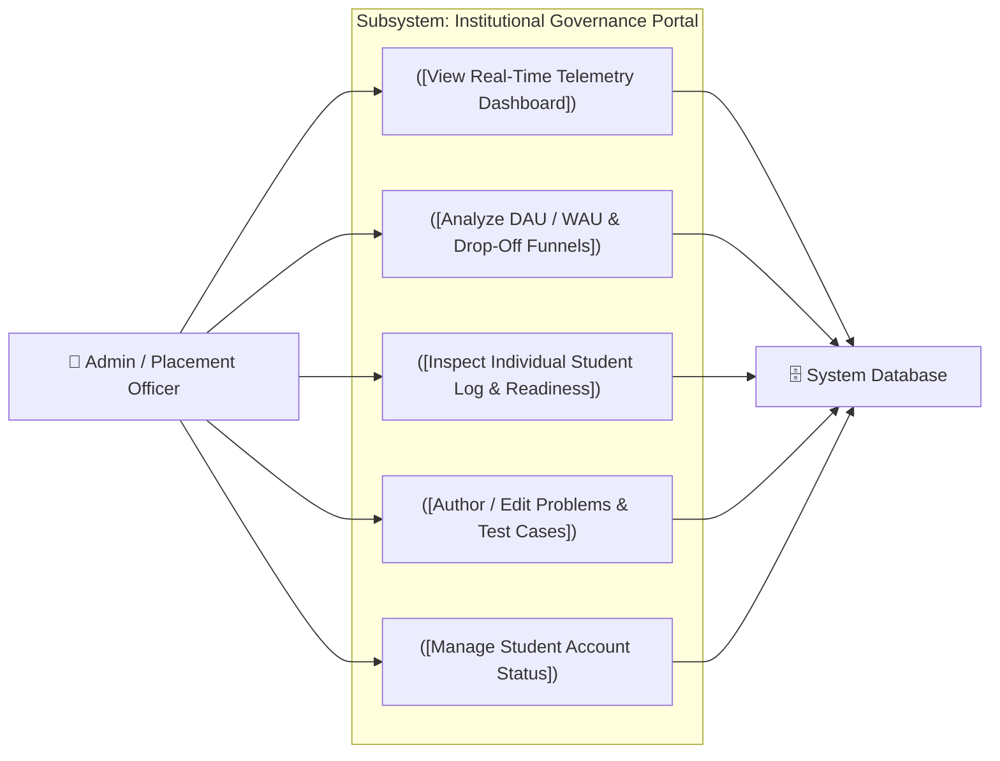

---

### 2.4 Tabular Use Case Specifications

#### Use Case: UC-04 Submit Code Solution
- **Primary Actor**: Student Candidate
- **Supporting Actors**: Code Judge Sandbox (Docker/cgroups), PostgreSQL
- **Preconditions**:
  1. Student is authenticated with a valid JWT token.
  2. Student has opened a valid coding problem in the DSA Arena.
- **Main Success Scenario**:
  1. Student writes code in Monaco Editor and clicks "Submit".
  2. System captures source code, programming language (`python`, `cpp`, `java`, `javascript`), and problem identifier.
  3. System spins up an ephemeral execution container or subprocess with CPU limit (2.0s) and memory ceiling (256MB).
  4. Code is compiled (if C++/Java) and executed against hidden test cases.
  5. Test outputs are diff-checked against expected answers.
  6. All test cases match: System issues `Accepted` verdict, calculates runtime/memory percentiles, updates user XP (+XP), records submission in `submissions` table, and logs telemetry.
  7. Client UI displays success animation with confetti and execution statistics.
- **Alternative / Failure Flows**:
  - *4a. Compilation Error*: Sandbox returns compiler diagnostic text; system marks submission as `Compile Error` and returns compiler traceback to Monaco editor.
  - *4b. Time Limit Exceeded (TLE)*: Subprocess/container exceeds 2.0s CPU time; system kills process via SIGKILL and tags submission as `TLE`.
  - *4c. Memory Limit Exceeded (MLE)*: Subprocess exceeds 256MB; memory cgroup aborts run; tagged as `MLE`.
  - *5a. Wrong Answer (WA)*: Output differs on test case $k$; system marks as `Wrong Answer` and highlights failing sample difference.

---

#### Use Case: UC-05 Execute SQL Practice Query
- **Primary Actor**: Student Candidate
- **Supporting Actors**: PostgreSQL Relational Database Engine
- **Preconditions**:
  1. Student is viewing a SQL problem with schema definition.
- **Main Success Scenario**:
  1. Student writes query in SQL editor and clicks "Execute".
  2. Backend validator parses statement tokens.
  3. Verifies that query strictly begins with `SELECT` or `WITH` and contains zero mutating statements (`DROP`, `ALTER`, `TRUNCATE`, `UPDATE`, `DELETE`, `INSERT`).
  4. Backend opens a dedicated database transaction: `BEGIN TRANSACTION`.
  5. Query executes inside the isolated transaction against sample tables.
  6. Backend generates structured JSON table rows and column headers.
  7. In an unconditional `finally` block, backend executes: `ROLLBACK`.
  8. Output dataset is compared with expected reference query results.
  9. Results are rendered in an interactive spreadsheet-style grid in the frontend.
- **Alternative Flow**:
  - *3a. Prohibited Token Detected*: Query contains destructive keywords; backend rejects query immediately with HTTP 400 (`Destructive SQL keywords prohibited`).

---

#### Use Case: UC-10 Settle Atomic Battle Winner
- **Primary Actor**: Student Candidate (Player 1 or Player 2)
- **Supporting Actors**: Redis Distributed Memory Store, WebSocket Server
- **Preconditions**:
  1. Both players have joined the same battle room via a 6-character room code.
  2. The battle is in the `active` state.
- **Main Success Scenario**:
  1. Player passes 100% of algorithmic test cases for the battle problem.
  2. Backend executes atomic Redis command: `SETNX room:{room_code}:winner {user_id}`.
  3. Redis returns integer reply `1` (indicating key did not previously exist; lock successfully acquired).
  4. Backend updates database status of `battle_rooms` to `completed`, designating this player as the sole champion.
  5. Backend awards +100 XP to the champion.
  6. WebSocket server broadcasts `room_winner` event containing winner identity and elapsed time to both connected clients.
  7. Frontend renders victory modal for winner and runner-up display for opponent with rematch options.
- **Alternative Flow**:
  - *3a. Lock Already Held*: Second player passes all test cases 10ms later. Redis `SETNX` returns integer `0` (key already exists). Backend designates player as `runner_up` with no race condition.

---

## 3. Data Flow Diagrams (DFD)

### 3.1 Data Flow Notation & Conventions
The following Data Flow Diagrams strictly follow standard Software Engineering notations (Gane & Sarson / Yourdon):
- **External Entity**: Rectangular box representing an external source or sink of data outside system boundary.
- **Process**: Rounded box or circle representing a computation, transformation, or verification step.
- **Data Flow**: Directed arrows labeled with the exact data payload moving between entities, processes, and stores.
- **Data Store**: Open-ended parallel lines or labeled storage symbol indicating persistent repository (`D1`, `D2`, etc.).

---

### 3.2 DFD Level 0 — Context Diagram

The Context Diagram defines the global scope of **Code Quest**, depicting the boundary between external stakeholders/services and the platform.

```mermaid
flowchart TD
    %% External Entities
    subgraph Entities["External Entities"]
        student["👤 Student / Candidate"]
        admin["👔 Institution Admin / TPO"]
        sandbox["📦 Isolated Sandbox (Docker / cgroup)"]
        gemini["🤖 Google Gemini 1.5 Flash API"]
    end

    %% Central Process
    codequest["0.0<br/><b>CODE QUEST PLATFORM</b><br/>Intelligent Placement & Assessment Ecosystem"]

    %% Student Data Flows
    student -->|"Credentials, Profile Info"| codequest
    student -->|"Source Code Submissions"| codequest
    student -->|"SQL Queries"| codequest
    student -->|"MCQ Answers & Puzzle Solutions"| codequest
    student -->|"Battle Commands (Create/Join/Submit)"| codequest
    student -->|"Interview Responses (Chat Turns)"| codequest
    student -->|"Resume Binary (PDF Document)"| codequest

    codequest -->|"Auth Tokens (JWT) & Profile Stats"| student
    codequest -->|"Execution Verdicts (Pass/Fail/TLE/MLE)"| student
    codequest -->|"SQL Result Grids & Validation Tables"| student
    codequest -->|"Assessment Scores & Solution Hints"| student
    codequest -->|"Live Battle State & Winner Broadcasts"| student
    codequest -->|"Dynamic AI Questions & Scorecards"| student
    codequest -->|"ATS Match Score & STAR Rewrite Tips"| student

    %% Admin Data Flows
    admin -->|"Curriculum Content (Problems, MCQs, Tests)"| codequest
    admin -->|"Admin Queries & Account Actions"| codequest

    codequest -->|"Institutional Telemetry (DAU, WAU, Funnels)"| admin
    codequest -->|"Student Deep-Dive Activity Logs"| admin

    %% Sandbox Data Flows
    codequest -->|"Untrusted Source Code & Test Inputs"| sandbox
    sandbox -->|"Execution Output, CPU Time, Memory, Exit Code"| codequest

    %% Gemini AI Data Flows
    codequest -->|"Interview Transcripts & Prompt Templates"| gemini
    codequest -->|"Extracted Resume Text & Job Role Standards"| gemini
    gemini -->|"Generated AI Interview Questions & Rubric Scores"| codequest
    gemini -->|"ATS Match Percentage, Keyword Gaps & Advice"| codequest
```

#### ASCII Box Diagram (Context Level 0)
```
                               ┌────────────────────────────────┐
                               │     Google Gemini 1.5 Flash    │
                               └────────────────────────────────┘
                                    │ ▲                     │ ▲
     AI Interview & ATS Prompts    │ │                     │ │ AI Responses & Rubric Scores
                                    ▼ │                     ▼ │
 ┌──────────────────────┐      ┌───────────────────────────────────┐      ┌─────────────────────────┐
 │   Student Candidate  │─────►│                0.0                │─────►│  Institution Admin/TPO  │
 │                      │◄─────│            CODE QUEST             │◄─────│                         │
 └──────────────────────┘      │             PLATFORM              │      └─────────────────────────┘
  - User Credentials            └───────────────────────────────────┘       - Curriculum Additions
  - Source Code / SQL                ▲ │                     ▲ │            - Filter & Drill Queries
  - Battle WebSockets                │ │                     │ │            - Account Moderation
  - PDF Resume                       │ ▼                     │ ▼
                               ┌────────────────────────────────┐
                               │   Code Judge Sandbox (Docker)  │
                               └────────────────────────────────┘
                                - Compilation & Execution Limits
                                - Exit Codes, Runtime & Memory
```

---

### 3.3 DFD Level 1 — System Decomposition Diagram

Level 1 explodes the platform into its eight fundamental functional subsystems and six core data stores.

*High-Resolution Image: [images/data_flow_diagram.jpg](./images/data_flow_diagram.jpg)*

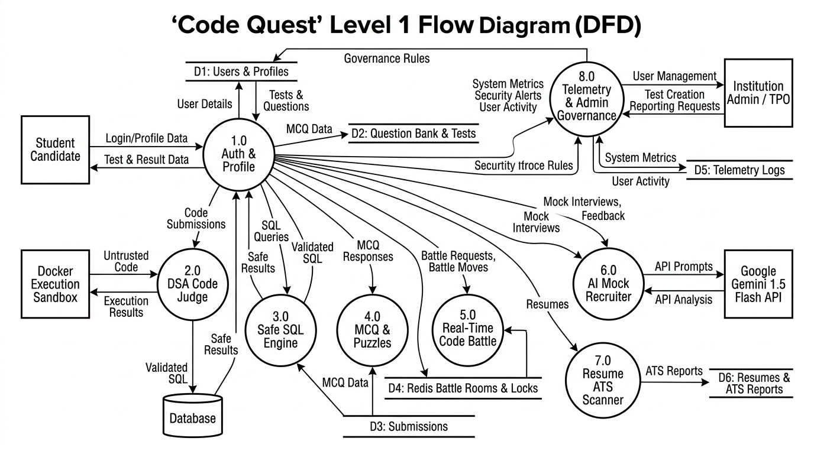

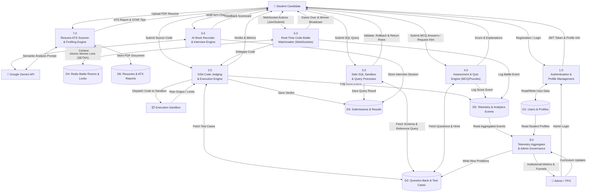

---

### 3.4 DFD Level 2 — Micro-Process Pipelines

#### 3.4.1 DFD Level 2.1: DSA Code Compilation & Sandboxed Execution

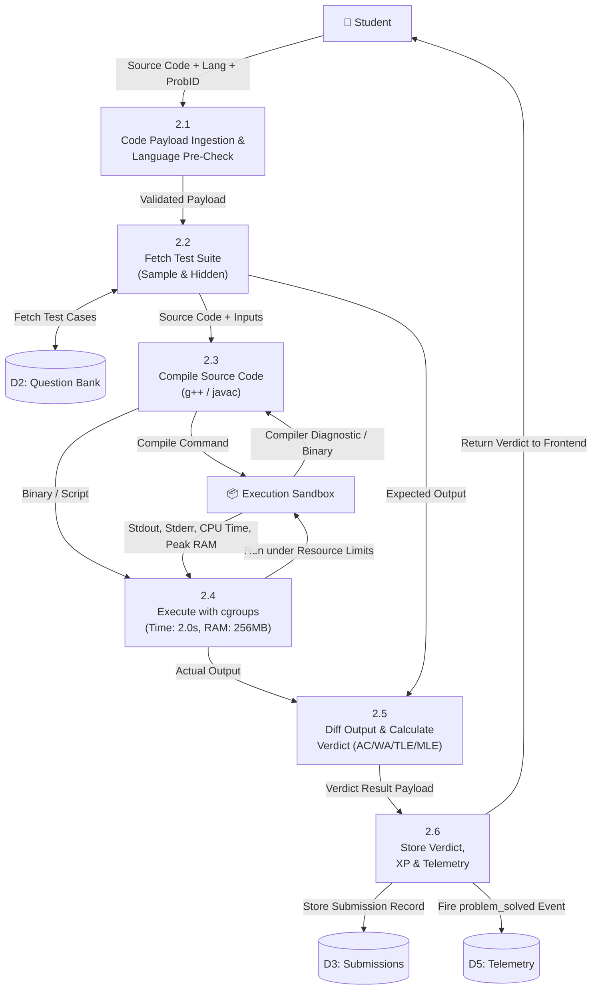

---

#### 3.4.2 DFD Level 2.2: Safe SQL Transactional Execution Engine

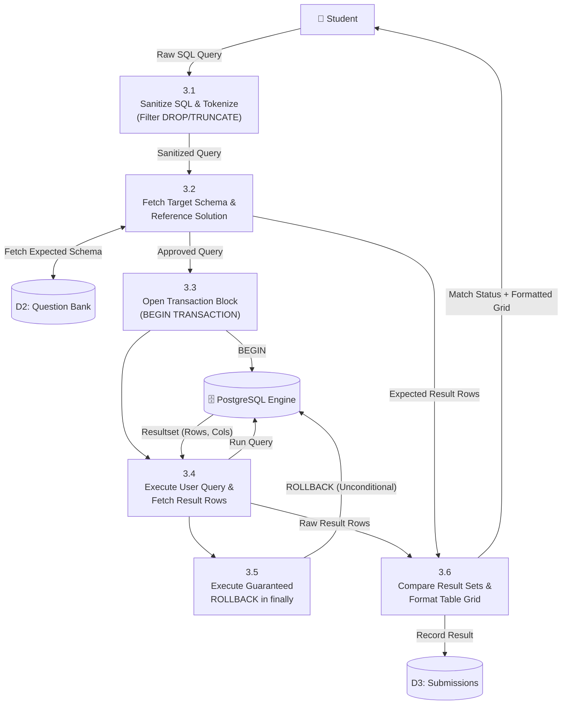

---

#### 3.4.3 DFD Level 2.3: Real-Time Battle Matchmaking & Redis SETNX Settlement

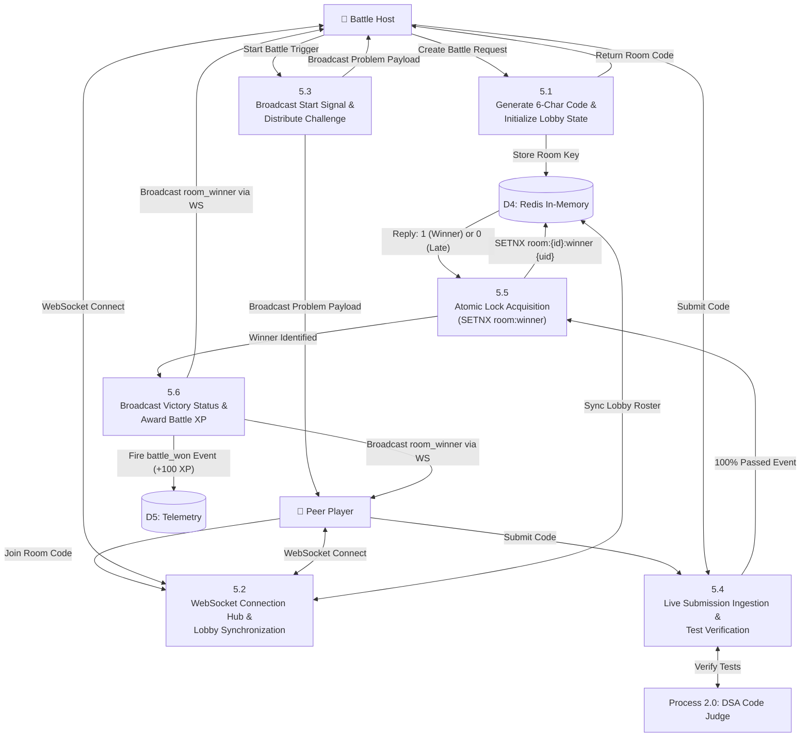

---

#### 3.4.4 DFD Level 2.4: AI Mock Interview & Resume ATS Parsing Flow

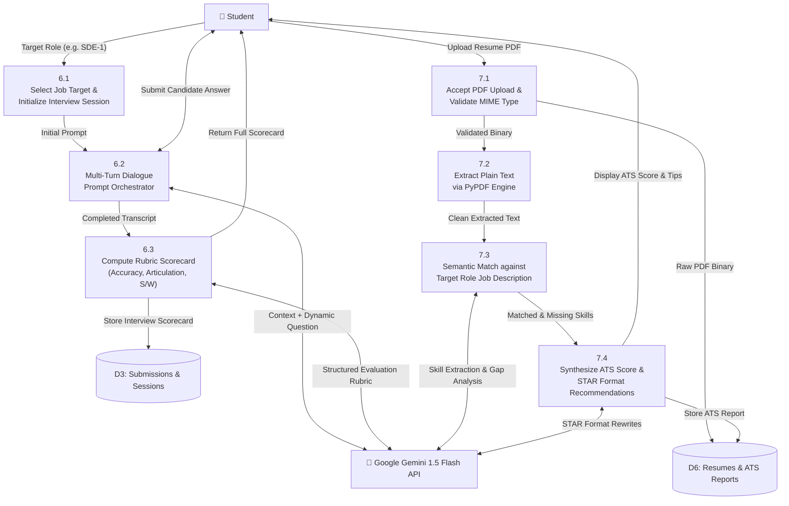

---

## 4. Data Dictionary

The following table defines the key data structures and payloads moving across the DFD processes:

| Data Flow Item | Source | Destination | Content Description / Schema |
|---|---|---|---|
| **User Credentials** | Student / Admin | Process 1.0 | `email` (string), `password` (string, plaintext), `college` (string), `graduation_year` (int). |
| **JWT Token Payload** | Process 1.0 | Student / Admin | `access_token` (JWT string), `refresh_token` (JWT string), `token_type` ("Bearer"), `role` ("user" \| "admin"). |
| **Source Code Submission** | Student | Process 2.0 | `problem_id` (UUID), `language` ("python" \| "cpp" \| "java" \| "javascript"), `source_code` (string). |
| **Sandbox Execution Results** | Sandbox | Process 2.0 | `stdout` (string), `stderr` (string), `exit_code` (int), `execution_time_ms` (float), `memory_used_kb` (int). |
| **SQL Submission Payload** | Student | Process 3.0 | `problem_id` (UUID), `sql_query` (string, SELECT/WITH only). |
| **SQL Output Grid** | Process 3.0 | Student | `columns` (array of strings), `rows` (array of row objects), `is_correct` (boolean), `execution_time_ms` (float). |
| **Battle WebSocket Event** | Student / WS Hub | Process 5.0 | `event_type` ("join" \| "submit" \| "ping"), `room_code` (string), `player_id` (UUID), `payload` (JSON object). |
| **Winner Distributed Lock** | Process 5.0 | Redis (D4) | Key: `room:{room_code}:winner`, Value: `user_id`, Expire: 3600 seconds. Set via atomic `SETNX`. |
| **Gemini Interview Turn** | Process 6.0 | Gemini API | System instructions (role prompt), conversation history (`role`, `parts`), current candidate reply. |
| **Rubric Scorecard** | Gemini API | Process 6.0 | JSON: `overall_score` (0-100), `technical_score` (0-100), `communication_score` (0-100), `strengths` ([]), `weaknesses` ([]), `suggestions` ([]). |
| **Extracted Resume Text** | Process 7.2 | Process 7.3 | Raw ASCII/UTF-8 string parsed from uploaded PDF binary pages via `pypdf`. |
| **ATS Audit Report** | Process 7.4 | Student | JSON: `ats_score` (0-100), `matched_skills` ([]), `missing_skills` ([]), `star_rewrites` ([]). |
| **Telemetry Event Log** | Processes 2/4/5/6 | Data Store D5 | `event_id` (UUID), `user_id` (UUID), `event_type` (string), `metadata` (JSON), `created_at` (timestamp). |

---

## 5. Summary & Traceability Matrix

| Requirement ID | Module | Primary Use Case | DFD Process Mapping | Primary Data Store |
|---|---|---|---|---|
| **FR-1** | Authentication & RBAC | UC-01, UC-02 | Process 1.0 | D1 (Users & Profiles) |
| **FR-2** | DSA Coding Arena & Judge | UC-03, UC-04 | Process 2.0 | D2 (Questions), D3 (Submissions) |
| **FR-3** | Safe SQL Practice Lab | UC-05 | Process 3.0 | D2 (Questions), D3 (Submissions) |
| **FR-4** | CS Fundamentals MCQs | UC-06 | Process 4.0 | D2 (Questions), D5 (Telemetry) |
| **FR-5** | Logic & Aptitude Puzzles | UC-07, UC-08 | Process 4.0 | D2 (Questions), D5 (Telemetry) |
| **FR-6** | Multiplayer Code Battles | UC-09, UC-10 | Process 5.0 | D4 (Redis Rooms), D5 (Telemetry) |
| **FR-7** | AI Mock Recruiter | UC-11 | Process 6.0 | D3 (Submissions), Gemini API |
| **FR-8** | Resume ATS Scanner | UC-12 | Process 7.0 | D6 (Resumes), Gemini API |
| **FR-9** | Placement Readiness Index | UC-02 | Process 1.0, 8.0 | D1 (Profiles), D5 (Telemetry) |
| **FR-10**| Admin Telemetry & Portal | UC-13, UC-14, UC-15, UC-16 | Process 8.0 | D1, D2, D5 |
