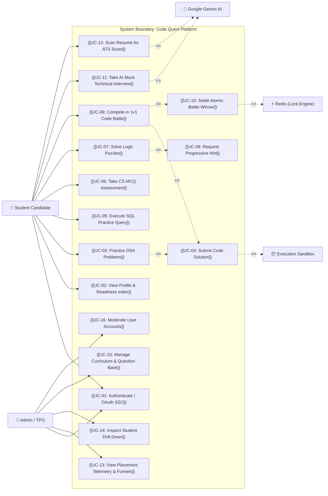
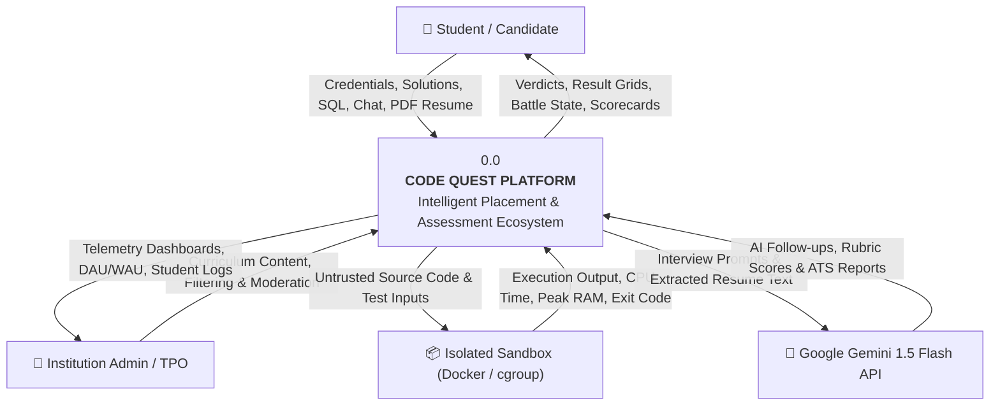
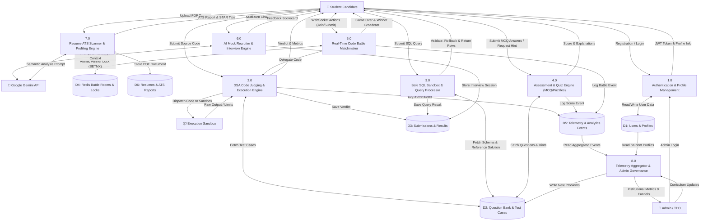
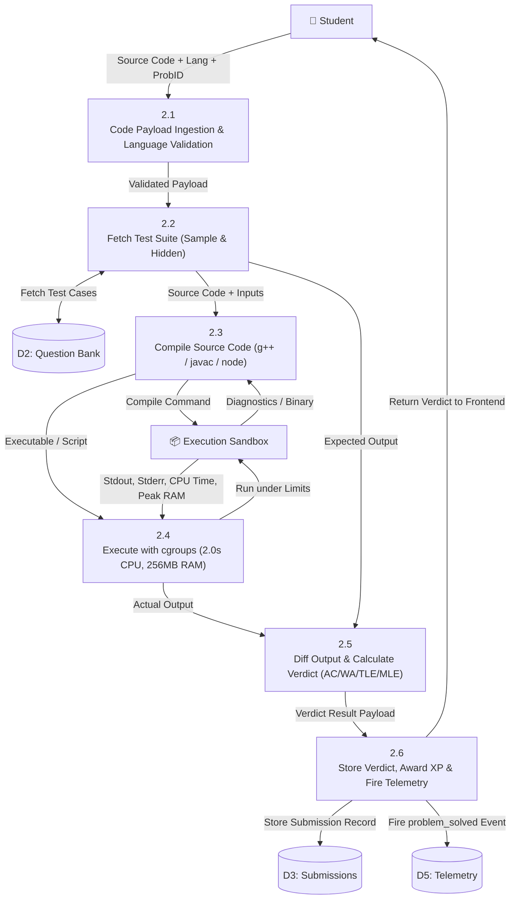
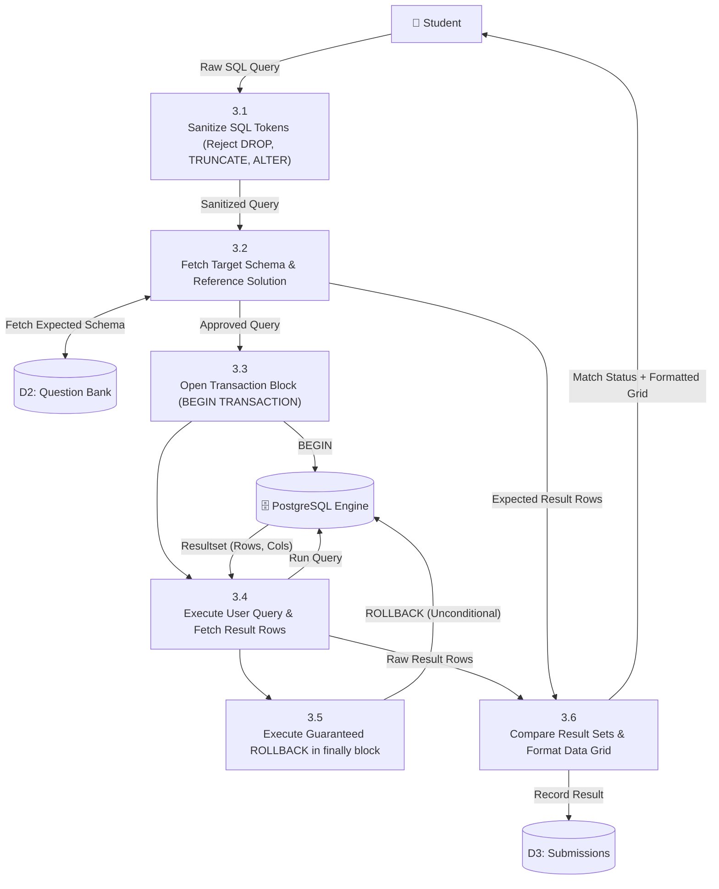
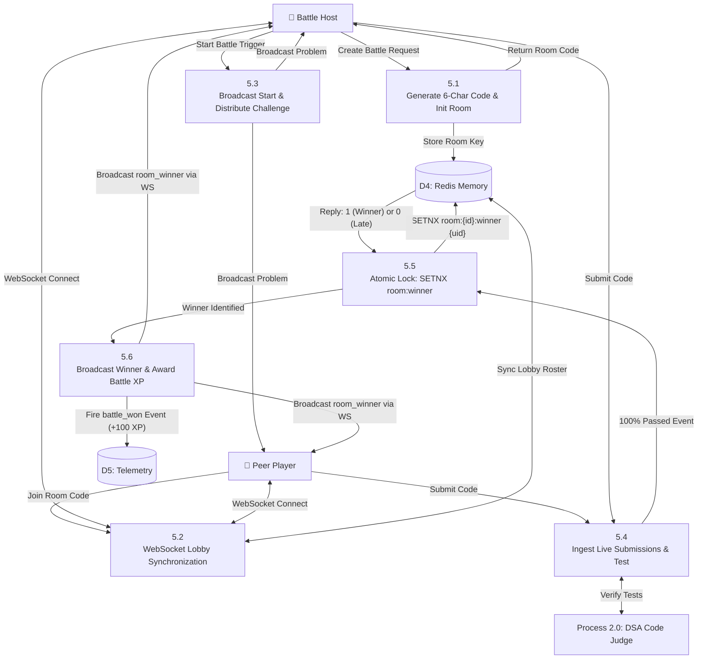

# Project Synopsis, Problem Analysis & Software Requirements Specification (SRS)
## Project Name: **Code Quest (Placement Preparation & Assessment Platform)**

---

# Part 1: Project Synopsis

### 1.1 Project Title
**Code Quest**: An Enterprise-Grade Intelligent Placement Preparation, Live Assessment, and Multi-Client Technical Hiring Ecosystem.

---

### 1.2 Executive Summary / Abstract
In the modern technical recruitment landscape, graduating engineering students face severe challenges: fragmented study tools, lack of unified benchmark metrics, high costs of mock interviews, and zero real-time visibility for institutional Training and Placement Offices (TPOs). 

**Code Quest** is an integrated, full-stack, multi-client software ecosystem engineered to bridge the gap between academic education and technical industry hiring standards. The platform unifies:
1. **Interactive Data Structures & Algorithms (DSA) Arena** with multi-tier code execution (Dockerized sandbox and isolated subprocess execution with cgroups and timeout bounds).
2. **Safe SQL Execution Playground** supporting real relational schema manipulation under transactional isolation and guaranteed rollback.
3. **CS Fundamentals & Domain Assessments** covering Operating Systems, DBMS, Computer Networks, Object-Oriented Programming, and Quantitative Aptitude.
4. **Real-Time Multiplayer "Code Battles"** utilizing WebSockets and Redis atomic distributed locking (`SETNX`) for zero-race-condition competitive coding.
5. **AI-Powered Recruiter Technical Interviews** driven by Google Gemini 1.5 Flash with rubric-graded evaluations and actionable candidate scorecards.
6. **AI ATS Resume Analyzer** leveraging PyPDF text extraction and LLM semantic matching against target job profiles.
7. **Institutional Admin & Telemetry Engine** providing real-time student activity tracking, cohort analytics, DAU/WAU metrics, drop-off funnels, and dynamic curriculum management.
8. **Cross-Platform Access** via modern React Web platforms, an administrative dashboard, and a React Native mobile application for continuous learning.

---

### 1.3 Problem Context & Need
Traditional placement preparation is siloed:
- Candidates solve DSA problems on platforms like LeetCode or HackerRank, but lack integrated SQL practice, aptitude testing, and interview simulation.
- College Placement Cells have no real-time telemetry or data analytics to identify struggling students prior to on-campus placement drives.
- High-quality technical mock interviews with experienced software engineers cost upwards of $50–$100 per session, making them inaccessible to the average student.
- Peer-to-peer competitive programming under live pressure is rarely practiced, leading to interview panic and poor time management.

**Code Quest** resolves these systemic inefficiencies into a single, cohesive, enterprise-ready platform.

---

### 1.4 Objectives of the Project
- **Unified Skill Development**: Deliver an end-to-end curriculum spanning DSA, SQL, Core CS Subjects, System Design, and Aptitude.
- **Fair & Safe Code Execution**: Build a multi-language remote judge capable of safely compiling and executing untrusted user code (Python, C++, Java, JavaScript) within tight memory, CPU, and execution-time limits.
- **Safe Relational Playground**: Allow students to execute raw SQL queries against real database instances without security compromises or persistent data corruption using transaction-level rollbacks.
- **Competitive Pressure Simulation**: Implement live 1v1 and multiplayer code battles with sub-second synchronization and atomic winner resolution.
- **Democratized AI Mentorship**: Provide conversational, multi-turn AI mock interviews and ATS resume reviews powered by LLMs at near-zero marginal cost.
- **Institutional Telemetry & Governance**: Enable TPOs and university administrators to track cohort readiness, problem solve rates, and weak domain areas through a dedicated management portal.

---

### 1.5 Technology Stack Overview

| Tier / Subsystem | Technologies & Frameworks |
|---|---|
| **Frontend (Student Web)** | React 18, Vite, TypeScript, TailwindCSS, Monaco Code Editor, Lucide Icons, Canvas Confetti |
| **Admin Portal** | React 18, Vite, TypeScript, TailwindCSS, Headless UI, Recharts |
| **Mobile Client** | React Native (Expo SDK), TypeScript, React Navigation |
| **Backend API Services** | Python 3.11+, FastAPI (Async REST & WebSockets), SQLAlchemy ORM, Pydantic v2 |
| **Relational Database** | PostgreSQL 15+ (Production) / SQLite (Dev & Automated Unit Testing) |
| **Caching & Message Broker** | Redis 7+ (Pub/Sub, Battle Rooms, Atomic Distributed Locks via `SETNX`) |
| **Task Queue & Workers** | Celery + Redis (Asynchronous resume processing, long-running AI inferences) |
| **Code Judge Sandbox** | Docker Engine (Alpine-based execution containers with cgroup resource constraints) |
| **Artificial Intelligence** | Google Gemini 1.5 Flash API (Structured Prompts, Multi-turn Chat, ATS Scoring) |
| **Authentication & Security** | OAuth 2.0 (Google Sign-In), JWT (Access + Refresh tokens), Passlib (Argon2 / Bcrypt) |

---

### 1.6 Key Deliverables & Modules
1. **Student Web Application**: High-performance responsive web client for candidates.
2. **Admin & Faculty Portal**: Comprehensive analytics, student tracking, and curriculum CMS.
3. **Cross-Platform Mobile App**: Android/iOS app for on-the-go practice, MCQs, and flashcards.
4. **FastAPI Microservices Backend**: Secure, scalable asynchronous REST and WebSocket API.
5. **Multi-Language Isolated Code Judge**: Multi-tier sandbox for compilation and execution.
6. **Complete Documentation Suite**: Architectural blueprints, API references, schema specifications, and testing suites.

---

# Part 2: Problem Analysis

### 2.1 Background & Context
Campus placements and early-career software engineering recruitment have become hyper-competitive. Top tier technology companies (FANG, unicorns, and major service enterprises) enforce rigorous multi-stage hiring funnels:
1. **Online Assessment (OA)**: Algorithmic challenges (DSA), SQL queries, and CS fundamentals MCQs with strict time limits.
2. **Technical Interview Rounds**: Live coding, algorithmic reasoning, and architectural/system puzzles.
3. **Resume Screening**: Algorithmic ATS filtration discarding over 70% of resumes before human review.
4. **Behavioral & HR Rounds**: Communication, cultural fit, and behavioral scenario assessments.

### 2.2 Identification of Key Problems & Pain Points

#### Pain Point 1: Tool Fragmentation and Cognitive Overload
Students typically navigate between 4 to 6 disparate platforms:
- LeetCode / HackerRank for DSA.
- GeeksforGeeks or Sanfoundry for CS Core MCQs.
- W3Schools or SQLZoo for SQL queries.
- Commercial mock interview platforms ($$$) for interview practice.
- Generic online ATS checkers with black-box scoring.
*Consequence*: Disjointed progress tracking, zero holistic readiness visibility, and learning fatigue.

#### Pain Point 2: Lack of Live Competitive Pressure Simulation
Solving algorithmic problems in isolation without time constraints does not replicate the high-stress environment of live technical assessments and pair-programming interviews. Students freeze during live tests due to lack of competitive exposure.

#### Pain Point 3: Institutional Blind Spots for Placement Cells
University Training and Placement Officers (TPOs) rely on outdated self-reported spreadsheets or periodic manual tests. They possess:
- No real-time data on student practice consistency (streaks, daily problem solving).
- No domain-specific diagnostic metrics (e.g., whether a cohort is weak in Dynamic Programming vs. Database Normalization).
- Inability to offer targeted interventions before placement season begins.

#### Pain Point 4: Economic Barrier to High-Quality Mock Interviews
Human-led technical mock interviews require experienced industry mentors. The cost ($50 to $150 per hour) is prohibitive for tier-2 and tier-3 college students.

#### Pain Point 5: Security & Isolation Risks in Code Execution
Running untrusted arbitrary code submitted by thousands of candidates introduces severe security risks:
- Malicious exploits (fork bombs, infinite loops, memory leaks, file system tampering).
- Accidental destruction or corruption of shared practice databases if SQL statements modify persistent tables.

---

### 2.3 Root Cause Analysis (Fishbone / Ishikawa Diagram)

```
        PEOPLE                          PROCESS
Students (Siloed prep,        No standardized readiness metrics
 interview anxiety, panic)    Late intervention by Placement Cells
          \                                /
           \                              /
            ─────────────┬───────────────
                         │
                         ▼
             [PLACEMENT INEFFICIENCY & HIGH REJECTION RATES]
                         ▲
            ─────────────┴───────────────
           /                              \
          /                                \
Tools (Fragmented platforms,    Execution (Security risks, high cost
 expensive mock interviews)     of mentors, lack of live battle engine)
       TECHNOLOGY                       ENVIRONMENT
```

---

### 2.4 Stakeholder Impact Matrix

| Stakeholder | Current Pain Points | Code Quest Value Proposition |
|---|---|---|
| **Students / Job Seekers** | High platform fragmentation; expensive interview prep; lack of personalized feedback and readiness scoring. | One-stop ecosystem with DSA, SQL, MCQs, AI interviews, ATS resume audits, and live battle arenas with gamified XP. |
| **College TPOs & Faculty** | Manual tracking; inability to detect lagging students; lack of analytics on cohort skill gaps. | Centralized Admin Portal with real-time telemetry, DAU/WAU metrics, student deep-dives, and automated curriculum management. |
| **Recruiters & Companies** | High volume of mismatched candidates; resume fraud; inflated self-reported ratings. | Verified, data-backed candidate readiness index, verifiable submission histories, and domain proficiency ratings. |

---

### 2.5 Feasibility Study

#### A. Technical Feasibility
- **Asynchronous Concurrency**: FastAPI and Python `asyncio` natively support thousands of concurrent WebSocket connections for live battles and telemetry feeds.
- **Sandboxed Execution**: Linux cgroups and containerized Docker runtimes provide robust isolation for untrusted code execution with strict timeouts and memory caps (e.g., 256MB, 2.0s CPU time).
- **AI Integration**: Google Gemini 1.5 Flash provides state-of-the-art token efficiency, low latency (< 1.5s response), and rich context windows for multi-turn interview interactions and ATS document parsing.
- *Conclusion*: **Technically Highly Feasible**.

#### B. Operational Feasibility
- The system features intuitive, modern UI designs (built with React 18 and TailwindCSS) requiring zero training for students or administrators.
- Supports both web browsers and mobile devices, ensuring ubiquitous access across desktop and mobile networks.
- *Conclusion*: **Operationally Highly Feasible**.

#### C. Economic Feasibility
- Built predominantly on open-source technologies (PostgreSQL, Redis, Python, React, Docker).
- Cloud hosting costs are minimal due to efficient local container sandboxing and cost-effective Gemini 1.5 Flash API pricing.
- Eliminates the need for paid human mock interview platforms.
- *Conclusion*: **Economically Highly Feasible**.

#### D. Legal and Compliance Feasibility
- Candidate submissions and resumes are stored securely with cryptographic hashing of credentials (`bcrypt`).
- Complies with data privacy best practices by executing code in ephemeral containers that leave no trace of user data or malicious payloads.
- *Conclusion*: **Legally Viable & Compliant**.

---

# Part 3: Software Requirements Specification (SRS)
### Based on IEEE Std 830-1998 / ISO/IEC/IEEE 29148:2018 Standards

---

## 1. Introduction

### 1.1 Purpose
This Software Requirements Specification (SRS) document details the complete functional and non-functional requirements for the **Code Quest** platform. It provides a formal contract between stakeholders, architectural developers, frontend/backend engineers, and quality assurance teams.

### 1.2 Document Conventions
- **Shall / Must**: Mandatory requirement.
- **Should**: Highly recommended requirement.
- **May**: Optional or future enhancement.
- Unique Identifiers: Functional Requirements are indexed as **`FR-x`**, Non-Functional Requirements as **`NFR-x`**.

### 1.3 Intended Audience
- Software Engineers and Full-Stack Developers.
- System Architects and DevOps Engineers.
- College Training & Placement Officers (TPOs) and Academic Reviewers.
- Project Evaluators and Academic Examiners.

### 1.4 Project Scope
Code Quest encompasses:
- An intelligent web client for students.
- An institutional monitoring portal for administrators and educators.
- A cross-platform mobile application for mobile learning.
- An asynchronous backend microservice architecture with sandboxed compilation, safe transactional SQL query execution, WebSocket distributed matchmaking, and LLM-powered mentorship.

---

## 2. Overall Description

### 2.1 System Architecture & Context Diagram

```
┌─────────────────────────────────────────────────────────────────────────────────┐
│                                   CLIENT TIER                                   │
│  ┌─────────────────────────────┐ ┌───────────────────────────┐ ┌──────────────┐ │
│  │ Student Web (React 18/Vite) │ │ Admin Portal (React / TS) │ │ Mobile (Expo)│ │
│  └──────────────┬──────────────┘ └─────────────┬─────────────┘ └──────┬───────┘ │
└─────────────────┼──────────────────────────────┼──────────────────────┼─────────┘
                  │ HTTPS / WSS                  │ HTTPS                │ HTTPS   
                  ▼                              ▼                      ▼         
┌─────────────────────────────────────────────────────────────────────────────────┐
│                                  GATEWAY & API                                  │
│                 FastAPI RESTful & WebSocket Service (Python 3.11)               │
│  - JWT Auth & RBAC               - Telemetry Ingestion Engine                   │
│  - Problem & MCQ Router          - WebSocket Battle Room Hub                    │
│  - SQL Transaction Manager       - AI Gemini Integration Service                │
└────────┬───────────────────────────────┬──────────────────────────────┬─────────┘
         │                               │                              │          
         ▼                               ▼                              ▼          
┌──────────────────┐          ┌──────────────────────┐      ┌─────────────────────┐
│  DATABASE TIER   │          │  DISTRIBUTED MEMORY  │      │  EXECUTION SANDBOX  │
│  PostgreSQL 15+  │          │  Redis 7+ Cluster    │      │  Docker Containers  │
│  (Relational DB) │          │  - Battle Pub/Sub    │      │  - Python, C++,     │
│  - Users & Profl │          │  - SETNX Winner Lock │      │    Java, JavaScript │
│  - Submissions   │          │  - Session & Cache   │      │  - cgroups limits   │
│  - Analytics     │          └──────────────────────┘      └─────────────────────┘
└──────────────────┘                     │                                         
                                         ▼                                         
                              ┌──────────────────────┐                             
                              │   CELERY WORKERS     │                             
                              │  - Resume ATS Eval   │                             
                              │  - Deep AI Audits    │                             
                              └──────────────────────┘                             
```

### 2.2 User Classes and Characteristics

| User Persona | Role Description | Technical Capability | System Privileges |
|---|---|---|---|
| **Student Candidate** | College engineering student preparing for tech interviews. | Intermediate to Advanced | Access to coding arena, SQL sandbox, MCQs, puzzles, battles, AI interview, resume analysis, personal profile & telemetry. |
| **Institution Admin / TPO** | Placement director, professor, or college administrator. | Intermediate | Access to administrative dashboard, cohort telemetry, student progress deep-dive, curriculum/topic management, problem authoring. |
| **System Host / Recruiter** | Facilitator hosting technical battles or mock coding tests. | Advanced | Room creation, contest authoring, problem publishing, leaderboard observation. |

### 2.3 Operating Environment
- **Server OS**: Linux (Ubuntu 22.04 LTS / Alpine Linux) or Windows Server with Docker Engine.
- **Runtimes**: Python 3.11+, Node.js 18+, Redis 7.0+, PostgreSQL 15+.
- **Client Platforms**: Modern Evergreen Web Browsers (Chrome 110+, Firefox 110+, Safari 16+, Edge 110+) and Mobile OS (Android 10+, iOS 14+).

### 2.4 Design and Implementation Constraints
- **Isolation Constraint**: Untrusted user code must never be executed on the host OS without containerization or strict subprocess limits (`RLIMIT_CPU`, `RLIMIT_AS`).
- **Transactional SQL Constraint**: All learner-submitted queries must execute within an active transaction and terminate with an unconditional `ROLLBACK` to prevent state mutation.
- **Concurrency Constraint**: Live battle winner declaration must be race-condition-free via atomic Redis primitives (`SETNX`).
- **AI Latency Constraint**: AI mock interview generation must use streaming or low-latency Flash models (< 2.0s latency).

---

### 2.5 UML Use Case Modeling & System Actors

#### 2.5.1 Actor Taxonomy
- **Student / Candidate (Primary Actor)**: Solves DSA problems, tests SQL queries, attempts CS MCQs, competes in live battles, undergoes AI mock interviews, and scans resumes for ATS feedback.
- **Admin / TPO (Primary Actor)**: Placement officer/faculty tracking student readiness metrics, analyzing cohort performance funnels, and managing curriculum.
- **Battle Host (Specialized Actor)**: Student or facilitator creating private/public competitive rooms and broadcasting lobby access codes.
- **Code Judge Sandbox (Supporting Actor)**: Ephemeral Docker container or cgroup-isolated subprocess executing untrusted user code with CPU/memory limits.
- **Google Gemini 1.5 Flash (External Cloud Service)**: LLM engine executing dynamic multi-turn interview dialogues and semantic ATS keyword matching.
- **PostgreSQL / Redis (Data & Memory Engines)**: PostgreSQL provides relational durability and transactional rollback; Redis manages WebSocket rooms and atomic winner locking via `SETNX`.

#### 2.5.2 System-Wide UML Use Case Diagram

*Rendered image file: [images/use_case_diagram.jpg](./images/use_case_diagram.jpg)*




---

### 2.6 Data Flow Diagrams (DFD)

#### 2.6.1 DFD Level 0 — Context Diagram
The Level 0 Context Diagram establishes the boundary between Code Quest and all external human and system entities.



#### 2.6.2 DFD Level 1 — System Decomposition Diagram
Decomposes the global system into 8 functional modules and 6 persistent data stores.

*Rendered image file: [images/data_flow_diagram.jpg](./images/data_flow_diagram.jpg)*




#### 2.6.3 DFD Level 2 — Critical Subsystem Pipelines

##### Level 2.1: DSA Code Judging Pipeline


##### Level 2.2: Safe SQL Transactional Execution Pipeline


##### Level 2.3: Live Multiplayer Battle & Atomic Winner Settlement (Redis SETNX)


---

## 3. Detailed Functional Requirements (FR)

### **FR-1: User Authentication & Role-Based Access Control (RBAC)**
- **FR-1.1**: The system shall support candidate registration using email, password, and institutional metadata (college, degree, graduation year).
- **FR-1.2**: Passwords shall be cryptographically salted and hashed using `bcrypt`/`argon2`.
- **FR-1.3**: The system shall support Google OAuth 2.0 single sign-on with automatic account provisioning.
- **FR-1.4**: Authenticated sessions shall issue stateless JSON Web Tokens (JWT) comprising a short-lived access token (15–60 min) and a long-lived refresh token (7 days).
- **FR-1.5**: The system shall enforce role-based route guards (`User`, `Admin`).

### **FR-2: DSA Problem Solving & Multi-Language Isolated Code Judge**
- **FR-2.1**: The system shall maintain an indexed catalog of algorithmic challenges categorized by topic (Arrays, Linked Lists, Trees, DP, Graphs) and difficulty (Easy, Medium, Hard).
- **FR-2.2**: The code judge shall support execution across multiple languages: **Python 3**, **C++ (g++)**, **Java (OpenJDK)**, and **JavaScript (Node.js)**.
- **FR-2.3**: Untrusted code shall be dispatched to an isolated execution sandbox under strict limits:
  - Max CPU Execution Time: 2.0 seconds.
  - Max Memory Allocation: 256 Megabytes.
  - No network socket creation privileges.
- **FR-2.4**: The judge shall evaluate submissions against visible sample test cases and hidden test cases, returning granular verdicts: `Accepted`, `Wrong Answer`, `Time Limit Exceeded (TLE)`, `Memory Limit Exceeded (MLE)`, or `Compilation/Runtime Error`.

### **FR-3: Safe SQL Practice Lab with Transactional Isolation Engine**
- **FR-3.1**: The system shall provide an interactive SQL console with pre-seeded relational schemas (e.g., Employees, Departments, Orders, Products).
- **FR-3.2**: Before execution, the system shall validate incoming queries to ensure they only start with allowed tokens (`SELECT`, `WITH`) and reject destructive commands (`DROP`, `TRUNCATE`, `ALTER`, `GRANT`).
- **FR-3.3**: The execution engine shall execute the user's query within a dedicated database transaction block and execute an unconditional `ROLLBACK` in a `finally` clause, guaranteeing zero permanent mutations.
- **FR-3.4**: The system shall compare the candidate's query result set (column names, row contents, order) with the expected solution result set and return interactive data tables.

### **FR-4: CS Fundamentals & Core Domain Assessment Engine**
- **FR-4.1**: The system shall provide subject-wise Multiple Choice Question (MCQ) modules covering Operating Systems, Database Management Systems, Computer Networks, and Object-Oriented Programming.
- **FR-4.2**: The MCQ engine shall support timed testing, randomized option shuffling, negative marking calculations, and comprehensive post-attempt explanations.

### **FR-5: Puzzles, Aptitude & Scenario-based Reasoning Modules**
- **FR-5.1**: The system shall host logic puzzles, quantitative aptitude riddles, and system architecture scenarios.
- **FR-5.2**: The system shall support progressive hint disclosure (Hint 1, Hint 2) with corresponding XP deduction penalties.
- **FR-5.3**: Official solutions, reasoning breakdown, and time complexity analyses shall be made available upon completion.

### **FR-6: Real-Time 1v1 and Multiplayer "Code Battles"**
- **FR-6.1**: The system shall allow a host user to create a private or public Battle Room identified by a unique 6-character alphanumeric room code.
- **FR-6.2**: Matchmaking and room lobbies shall synchronize player joins, ready states, and problem distributions over bidirectional WebSockets (`/api/v1/battles/ws/{code}`).
- **FR-6.3**: When players submit code during an active battle, the judge shall evaluate all test cases.
- **FR-6.4**: The first candidate to pass 100% of test cases shall trigger an atomic Redis `SETNX room:{room_id}:winner <user_id>` operation. Only the winning operation shall succeed; all subsequent submissions shall receive runner-up status.
- **FR-6.5**: The system shall broadcast real-time game-over notifications, award +100 XP to the victor, update leaderboard standings, and enable instant rematches.

### **FR-7: AI-Powered Conversational Mock Technical Recruiter**
- **FR-7.1**: The system shall initiate adaptive, multi-turn mock interviews using the Google Gemini 1.5 Flash API based on candidate role targets (e.g., Frontend Engineer, Backend Python Developer, Full Stack SDE).
- **FR-7.2**: The AI interviewer shall dynamically present coding questions, review candidate responses, ask probing follow-up questions, and evaluate algorithmic edge cases.
- **FR-7.3**: Upon completion, the engine shall compute an objective scorecard comprising:
  - Overall Score (0-100).
  - Technical Accuracy Score (0-100).
  - Communication & Articulation Score (0-100).
  - Categorized list of Key Strengths, Weaknesses, and Actionable Improvement Suggestions.

### **FR-8: Intelligent Resume ATS Scanner & Skill Gap Profiler**
- **FR-8.1**: The system shall accept student resume uploads in PDF format.
- **FR-8.2**: Text extraction shall be performed via `pypdf` without altering document fidelity.
- **FR-8.3**: An LLM-driven ATS evaluation engine shall compare extracted candidate experiences and skills against industry standard job descriptions for the target role.
- **FR-8.4**: The engine shall output:
  - An overall ATS Compatibility Score (0-100).
  - Matched Technical Skills and Identified Skill Gaps.
  - Actionable formatting recommendations and bullet-point rewrite suggestions using the STAR (Situation, Task, Action, Result) methodology.

### **FR-9: Placement Readiness Index, Gamification & Roadmaps**
- **FR-9.1**: The system shall maintain a dynamic **Placement Readiness Score (0–100%)** calculated as a weighted formula across DSA mastery, SQL proficiency, Core CS score, battle win rate, and mock interview performance.
- **FR-9.2**: The platform shall track daily active streaks, awarding Experience Points (XP) and unlocking achievement badges (e.g., "SQL Maestro", "Streak Master", "Battle Centurion").
- **FR-9.3**: The system shall render interactive visual milestone roadmaps tailored to the candidate's target graduation timeline.

### **FR-10: Institutional Admin Portal & Telemetry Engine**
- **FR-10.1**: The system shall ingest granular telemetry events (`problem_solved`, `battle_participated`, `interview_completed`, `login_streak`).
- **FR-10.2**: The Admin Portal shall display institutional aggregate statistics: Total Enrolled Students, Daily Active Users (DAU), Weekly Active Users (WAU), and Topic Drop-off Funnels.
- **FR-10.3**: Admins shall be equipped to inspect individual student profiles, view full submission histories, toggle account status (activate/suspend), and manage curriculum content (adding problems, test cases, and MCQs).

---

## 4. External Interface Requirements

### 4.1 User Interfaces (UI/UX)
- **Design Philosophy**: Modern, high-contrast dark/light mode interfaces following clean typography (Inter / Roboto), glassmorphism, responsive grid layouts, and accessible color contrasts.
- **Code Editor**: Integrated Monaco Editor / CodeMirror with syntax highlighting, auto-indentation, bracket matching, and theme customization.
- **Responsive Layout**: Fluid breakpoints supporting Desktop (1920x1080, 1440x900), Tablet (768x1024), and Mobile Viewports (375x812).

### 4.2 Software Interfaces
- **PostgreSQL Database**: Connection via SQLAlchemy Async/Sync connection pooling (`pool_size=20`, `max_overflow=10`).
- **Redis Cache & PubSub**: Connection via `redis-py` for caching room states and channel subscriptions.
- **Google Gemini 1.5 Flash API**: Communicating over secure HTTPS with strict JSON Schema outputs for structured interview scores and ATS feedback.
- **Docker Engine Daemon**: Interfaced via Docker SDK for Python to spin up short-lived Alpine execution containers.

### 4.3 Communication Protocols
- **Client-to-Backend REST**: HTTP/2 over TLS 1.3, JSON payloads, Bearer JWT Authorization headers.
- **Real-Time Code Battles**: Persistent Full-Duplex WebSockets (`wss://`) with heartbeat ping/pong frames every 30 seconds.

---

## 5. Non-Functional Requirements (NFR)

### 5.1 Performance & Latency Requirements
- **NFR-1.1 (API Response Time)**: 95% of non-execution REST API requests shall resolve within **150 milliseconds**.
- **NFR-1.2 (Code Execution Latency)**: Sandbox startup and execution overhead shall not exceed **1.5 seconds** above the code run time.
- **NFR-1.3 (WebSocket Broadcasts)**: Live battle room status events shall be broadcast to all connected clients within **50 milliseconds** of an event trigger.
- **NFR-1.4 (AI Response Time)**: Gemini mock interview conversational turns shall respond within **2.0 seconds**.

### 5.2 Security & Integrity Requirements
- **NFR-2.1 (Credential Storage)**: Passwords shall never be stored in plaintext. They shall be hashed using `bcrypt` with work factor 12.
- **NFR-2.2 (Sandboxing Security)**: Code containers shall execute as non-root users (`nobody`) with read-only root filesystems, dropped capabilities (`CAP_DROP_ALL`), and disabled network access.
- **NFR-2.3 (SQL Safety)**: Queries shall run under non-superuser database roles with zero write permissions on production metadata tables.
- **NFR-2.4 (Injection Prevention)**: All SQL queries generated by backend services shall use parameterized SQLAlchemy expressions to prevent SQL injection.
- **NFR-2.5 (CORS & Headers)**: Cross-Origin Resource Sharing (CORS) shall explicitly whitelist approved frontend domains; security headers (`X-Content-Type-Options: nosniff`, `X-Frame-Options: DENY`) shall be enforced.

### 5.3 Reliability, Availability & Fault Tolerance
- **NFR-3.1 (High Availability)**: The backend API and database shall target 99.9% uptime during university placement seasons.
- **NFR-3.2 (Fallback Execution)**: In environments where Docker daemon access is restricted or unavailable, the backend judge shall seamlessly fallback to a locked-down subprocess executor with system resource limits.
- **NFR-3.3 (Data Durability)**: Database commits shall enforce ACID properties with Write-Ahead Logging (WAL) in PostgreSQL.

### 5.4 Scalability & Concurrency
- **NFR-4.1 (Horizontal Scalability)**: Stateless FastAPI instances can be replicated behind an Nginx or cloud load balancer.
- **NFR-4.2 (Concurrent Battle Rooms)**: The Redis Pub/Sub architecture shall comfortably sustain up to 500 concurrent live battle rooms without degrading message latency.

### 5.5 Usability & Maintainability
- **NFR-5.1 (Code Maintainability)**: The codebase adheres to strict modular directory structures, Pydantic type validation schemas, and flake8/black formatting guidelines.
- **NFR-5.2 (Test Coverage)**: Automated test suites using `pytest` shall cover critical paths including auth, problem submission, battle locks, and SQL rollback mechanisms.

---

## 6. Data Models & Entity Relationship Summary

### Entity Relationship Mapping

```
┌──────────────┐         1:1         ┌──────────────┐
│    users     │─────────────────────│   profiles   │
└──────┬───────┘                     └──────────────┘
       │
       │ 1:N
       ├─────────────────────────────┬─────────────────────────────┐
       ▼                             ▼                             ▼
┌──────────────┐              ┌──────────────┐              ┌──────────────┐
│ submissions  │              │ battle_rooms │              │  interviews  │
└──────┬───────┘              └──────┬───────┘              └──────┬───────┘
       │ 1:1                         │ 1:N                         │ 1:1
       ▼                             ▼                             ▼
┌──────────────┐              ┌──────────────┐              ┌──────────────┐
│coding_submis.│              │battle_partic.│              │interv_session│
└──────────────┘              └──────────────┘              └──────────────┘

┌──────────────┐         1:N         ┌──────────────┐         1:N         ┌──────────────┐
│    topics    │─────────────────────│  subtopics   │─────────────────────│  questions   │
└──────────────┘                     └──────────────┘                     └──────┬───────┘
                                                                                 │ 1:1
                                     ┌─────────────────────────────┬─────────────┴─────────────┐
                                     ▼                             ▼                           ▼
                              ┌──────────────┐              ┌──────────────┐            ┌──────────────┐
                              │  coding_det  │              │  sql_detail  │            │  mcq_detail  │
                              └──────────────┘              └──────────────┘            └──────────────┘
```

### Key Data Entities:
1. **`users`**: Unique UUID, email, hashed_password, auth_provider, is_active, is_admin, timestamps.
2. **`profiles`**: User FK, full name, college, degree, graduation year, target role, XP, streak count, placement readiness score, domain skill ratings (DSA, SQL, Aptitude, CS Fundamentals, Communication).
3. **`questions`**: Unique UUID, title, description, difficulty, question type, topic FK, subtopic FK, XP reward, company tags.
4. **`coding_details` & `sql_details`**: Language templates, test cases (input, expected output, hidden flags), schema initialization DDL.
5. **`battle_rooms` & `battle_participants`**: 6-character room code, host ID, status (`waiting`, `active`, `completed`), winner ID, participants, live submission scores.
6. **`analytics_events`**: Telemetry log recording user interactions, event types (`solve`, `battle_win`, `interview`), metadata payloads, and timestamps.
7. **`resumes` & `resume_analysis`**: Resume binary reference, ATS matching score, extracted competencies, missing keywords, and structured recommendations.

---

## 7. Verification & Acceptance Criteria

| ID | Requirement | Test Case / Verification Method | Acceptance Criteria |
|---|---|---|---|
| **AC-1** | User Registration & Auth | POST `/api/v1/auth/register` and `/api/v1/auth/login` with valid & invalid inputs. | Successful JWT generation with 200 OK; invalid credentials return 401 Unauthorized; passwords securely hashed. |
| **AC-2** | Code Execution & Judging | Submit correct, infinite loop, and memory-heavy code to `/problems/{id}/submit`. | Correct solution returns `Accepted`; infinite loop terminates at 2.0s with `TLE`; memory-heavy solution triggers `MLE`. |
| **AC-3** | Transactional SQL Safety | Submit `DROP TABLE` and valid `SELECT` statements to `/sql/problems/{id}/execute`. | Destructive commands return 400 Bad Request; valid queries return result tables; underlying database tables remain 100% unaltered. |
| **AC-4** | Race-Free Battle Resolution | Two concurrent client submissions passing all tests within 5 milliseconds of each other. | Exactly one client successfully claims Redis `SETNX` lock and receives `winner=True`; other receives `winner=False`. |
| **AC-5** | AI Mock Interview & Scoring | Start interview, post 3 answer rounds, finish session via `/ai/interviews/`. | System responds with intelligent follow-up questions and returns complete rubric scorecard with 0-100 scores. |
| **AC-6** | Resume ATS Parsing | Upload standard engineering PDF resume to `/ai/resume/upload`. | Returns valid JSON payload containing 0-100 ATS score, identified skill list, missing skills, and STAR format tips. |
| **AC-7** | Telemetry & Admin Analytics | Trigger user events and query `/api/v1/analytics/summary`. | Admin dashboard accurately reflects DAU, active counts, and event totals in real time. |

---

# Part 4: Conclusion & Future Scope

Code Quest establishes a modern, complete, and resilient technical placement ecosystem. By synthesizing isolated algorithmic code execution, safe transactional SQL mechanics, low-latency live competitive rooms, and cutting-edge Gemini LLM mentorship into a unified platform, it overcomes the severe fragmentation of contemporary interview preparation.

### Future Expansion Avenues:
1. **Proctored Assessments**: Integration of WebRTC-based AI gaze tracking and tab-switch detection for institutional examinations.
2. **Audio/Video AI Interviews**: Direct real-time speech-to-speech mock interviews using Gemini Multimodal Live API.
3. **Automated Company Test Pack Generators**: AI generation of company-specific test bundles replicating Amazon, Google, Microsoft, and TCS recruitment patterns.
